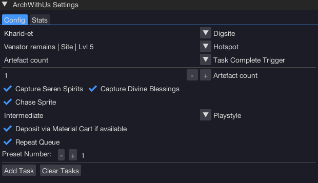

import React from 'react';
import TopBanner from '@site/src/components/TopBanner';
import ContentBlock from '@site/src/components/ContentBlock';
import Changelog from '@site/src/components/Changelog';
import BrowserWindow from '@site/src/components/BrowserWindow';
import changes from './changes.json'

<TopBanner title="ArchWithUs" version="v1.0.6" author="BotWithUs" offical="OFFICAL SCRIPT"  skill="Archaeology">
</TopBanner>

:::hidden

## Cost

:::

<ContentBlock title="Cost">

> - $18 USD / month (not including client access)

</ContentBlock>

:::hidden

## Features

:::

<ContentBlock title="Features">

> - A comprehensive, feature-complete bot for Archaeology that supports all dig sites and hotspots, waterfiend familiar, Grace of the Elves, porters, and plenty more!

</ContentBlock>

:::hidden

## Changelog

:::

<Changelog changes={changes}>

</Changelog>
