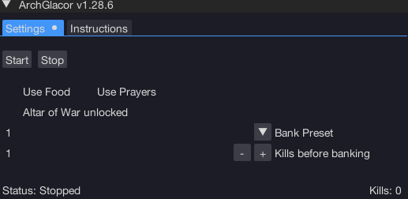
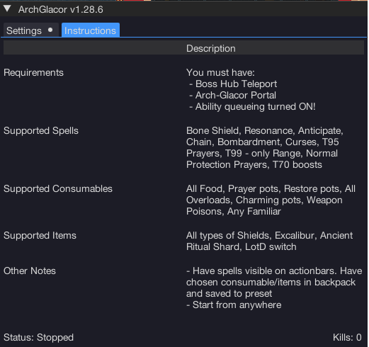

import React from 'react';
import TopBanner from '@site/src/components/TopBanner';
import ContentBlock from '@site/src/components/ContentBlock';
import Changelog from '@site/src/components/Changelog';
import BrowserWindow from '@site/src/components/BrowserWindow';
import changes from './changes.json'

<TopBanner title="Aggro ArchGlacor" version="v1.0.0" author="Aggro" skill="Necromancy">
</TopBanner>

:::hidden

## Cost

:::

<ContentBlock title="Cost">

> - $8 USD / month (not including client access)
>   :::danger Limitations

</ContentBlock>

:::hidden

## Features

:::

<ContentBlock title="Features">

> - Kills Arch Glacor up to 5/5
> - Supports Curses, Normal Prayers, and no Prayers (Just eating)
> - Supports Overloads, Weapon Poison, Excalibur, Ancient Ritual Shard, Familiars, Extreme potions

</ContentBlock>

:::hidden

## Requirements

:::
<ContentBlock title="Requirements">

- Boss Hub Teleport and Arch-Glacor Portal unlocked and visible.

</ContentBlock>

:::hidden

## Changelog

:::

<Changelog changes={changes}>

</Changelog>
