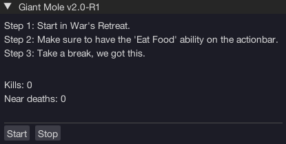

import React from 'react';
import TopBanner from '@site/src/components/TopBanner';
import ContentBlock from '@site/src/components/ContentBlock';
import Changelog from '@site/src/components/Changelog';
import BrowserWindow from '@site/src/components/BrowserWindow';
import changes from './changes.json'

<TopBanner title="Giant mole" version="v1.0.0" author="KBD" skill="Necromancy">
</TopBanner>

:::hidden

## Cost

:::

<ContentBlock title="Cost">

> - FREE / month (not including client access)

</ContentBlock>

:::hidden

## Features

:::

<ContentBlock title="Features">

> - Kills Giant mole up to 3 times before banking.
>   NOT suggested for low level combat

</ContentBlock>

:::hidden

## Changelog

:::

<Changelog changes={changes}>

</Changelog>
