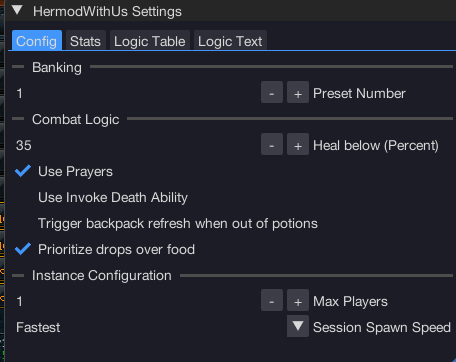
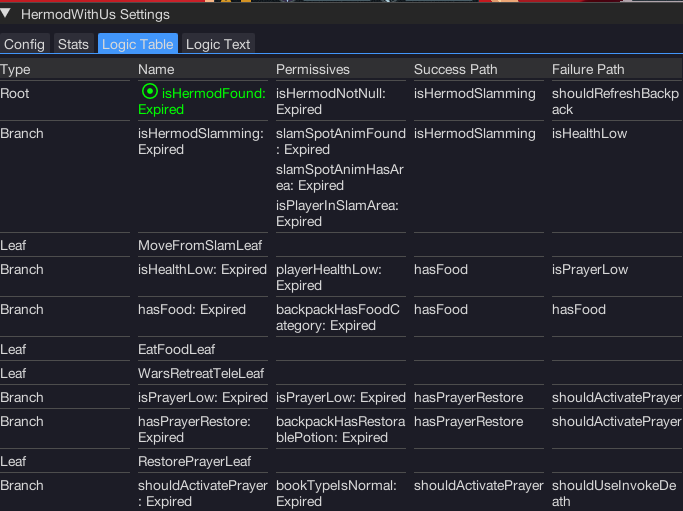

import React from 'react';
import TopBanner from '@site/src/components/TopBanner';
import ContentBlock from '@site/src/components/ContentBlock';
import Changelog from '@site/src/components/Changelog';
import BrowserWindow from '@site/src/components/BrowserWindow';
import changes from './changes.json'

<TopBanner title="HermodWithUs" version="v1.0.6" author="BotWithUs" offical="OFFICAL SCRIPT" skill="Necromancy">
</TopBanner>

:::hidden

## Cost

:::

<ContentBlock title="Cost">

> - FREE / month (not including client access)

</ContentBlock>

:::hidden

## Features

:::

<ContentBlock title="Features">

> - Full fight mechanics
> - Skeleton, Zombie, and Ghost conjure spawning
> - Invoke Death ability
> - Deflect / Protect Necromancy prayer
> - Prayer point renewal potions
> - Banking via War's Retreat
> - Instance configuration

</ContentBlock>

:::hidden

## Changelog

:::

<Changelog changes={changes}>

</Changelog>
