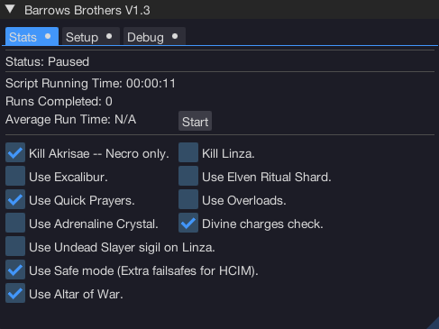

import React from 'react';
import TopBanner from '@site/src/components/TopBanner';
import ContentBlock from '@site/src/components/ContentBlock';
import Changelog from '@site/src/components/Changelog';
import BrowserWindow from '@site/src/components/BrowserWindow';
import changes from './changes.json'

<TopBanner title="Pizzas Barrows " version="v1.3" author="Pizza" skill="Necromancy">
</TopBanner>

:::hidden

## Cost

:::

<ContentBlock title="Cost">

> - FREE / month (not including client access)

</ContentBlock>

:::hidden

## Features

:::

<ContentBlock title="Features">

> - **Barrows Brother Script**: Designed to complete the Barrows Brothers minigame.
> - **Customizable Settings**: Tailor the bot's settings to suit individual goals.
> - **Safety Features**: Various failsafes to ensure you don't die or get stuck.

<strong>Safety Features Details</strong>

- Teleport to Wars and logout if any of these conditions become true:
  - Checks Sign of life cooldown.
  - If health falls below 2k.
  - If you run out of Divine Charges.
  - If your run energy runs to 0%.
  - If your preset is missing items.
  - If you have perished.

<strong>Settings</strong>

</ContentBlock>

:::hidden

## Requirements

:::
<ContentBlock title="Requirements">

> - War's Retreat unlocked
> - A portal directed to the 'Barrow Brothers'

</ContentBlock>

:::hidden

## Setup

:::
<ContentBlock title="Setup">

> Follow these steps to prepare for using the script:
>
> - **Start at War's Retreat.**
> - **Load a preset** with some food and a way to replenish prayer, using 'Load last preset'.
> - Ensure your preset has **enough free spaces for loot**; it will not clear space automatically.
> - Have **Revolution combat mode** turned on.
> - Set a **boss portal** to the Barrows brothers.
> - Place the **War's Retreat teleport** on your action bar.
> - Set and place **Quick-prayers 1** on your action bar.
> - Place **Surge** on your action bar.
> - Note: If killing Akrisae, this script only supports **Necromancy** (Dosent gear switch to avoid overheads).

<strong>Example Preset</strong>

### Additional Tips for Script Usage

> - **Puzzle Navigation:** If you run into navigation issues within the tunnels, consider increasing your 'Draw Distance' in the game settings and restart your client. This helps with smoother script operation.

> - **World Selection:** It's advisable to operate the script in a less populated world. This isn't mandatory but helps in reducing potential unexpected delays.

> - **Script Breaks and Resets:** Should the script malfunction, it will reset to War's Retreat. It may not solve puzzles correctly on occasion, and in such scenarios, a reset will also occur.

> - **Surge Solutions:** Solutions for surges have been simplified out of lazyness. They may not always work perfectly, so your understanding is appreciated (If faraway surge).

> - **Feedback and Bug Reporting:** If you detect any glitches or bugs, or if there are improvements you believe could be made, please do not hesitate to inform me.

Thank you, and best of luck with your adventures!

</ContentBlock>

:::hidden

## Changelog

:::

<Changelog changes={changes}>

</Changelog>
