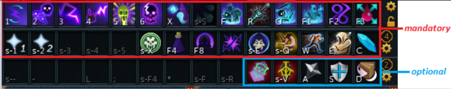
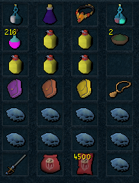
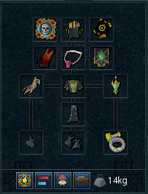
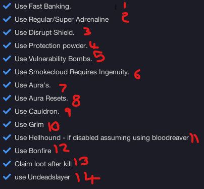

import React from 'react';
import TopBanner from '@site/src/components/TopBanner';
import ContentBlock from '@site/src/components/ContentBlock';
import Changelog from '@site/src/components/Changelog';
import BrowserWindow from '@site/src/components/BrowserWindow';
import changes from './changes.json'

<TopBanner title="Pizzas Vorkath " version="v1.0" author="Pizzanova" skill="Necromancy">
</TopBanner>

:::hidden

## Cost

:::

<ContentBlock title="Cost">

> - $120 USD / month (not including client access)
:::danger Limitations
- **This is an early access, please be fully aware of that. There is a very high chance you WILL encounter bugs**
:::
</ContentBlock>

:::hidden

## Features

:::

<ContentBlock title="Features">

> - **Vorkath Hardmode Script**: Kills runescapes newest boss vorkath on hardmode loots and stacks chests for later opening!
> - **Customizable Settings**: Many settings to try and get it perfect for your account.
> - **Safety Features**: Various failsafes to ensure you don't get stuck. (If you found ur account logged out and cant find why read list below.)
> - **Current GP Rates**: Currently ~80m / hr on average with current GE prices (Note that the vorkath scale, spikes, and book are way above GE Value so its more like ~90m+ / hr)
> - **Average Kill Times**: averaging 3:30 - 3:50 killtimes using BIS gear + Perks. It Averages around ~14 Kills an hour, will be around 4 Minute average with 13 Kills an hour if missing some of the opt ins / not BIS.

<strong>Safety Features Details</strong>

- Teleport to Wars and logout if any of these conditions become true:
  - If you run out of Divine Charges.
  - If your preset is missing items.
  - If your missing Runes OR ectoplasm
  - If you have an unbankable item in your invent

</ContentBlock>

:::hidden

## Requirements

:::
<ContentBlock title="Requirements">

<strong>Action Bar Example</strong>

> **This is an extremely Endgame Boss, The requirements here are required to take it on, make sure you meet those listed.**
> - T95 First Necromancer armour and T95 Necromancy Weapons With Good perks like (UndeadSlayer/Crackling/Biting).
> - Salve Amulet (e) + Essence of Finality.
> - Surge and Dive ability unlocked.
> - Abilty to use prism of restoration - (prif requirment).
> - Ancient Summoning unlocked for Blood Reaver (Default) Or Hellhound (Toggle).
> - 99+ Necromancy and all necromancy abilities and incantations unlocked from the well of Souls.
> - Overloads and Antifire protection potions (overload Salves cover this requirement).
> - 118 archaeology for Conservation of Energy (or boost from 110).
> - Jas book OR Erethidors Grimiore.
> - Adrenline pots idealy renewals.
> - Atleast 1 Vorkath kill to unlock Hardmode + the Portal
> - Necro zuk cape.
> - Permant Vigor passive (for now will add switch if someone needs it.)
> - Plenty of PVM supplys. (Blubbers,Brews,Overloads,Adrenpots,Prayer,Runes)

<ContentBlock title="Optional Requirements">

> **Having all Possible requirements ticked off will ensure a much better kill and result from this script**
> - Undead Slayer Abilty.
> - Vulnerability bomb.
> - Disruption shield and lunar spellbook swap.
> - Smoke cloud requires Ingenuity of the Humans also.
> - Protection powders(From Whirligigs at Hets Oasis OR GE)
> - Access to Mahjarat and other auras (Supreme Invigorate, Vampyrism, Dark Magic, Inspiration)

</ContentBlock>
</ContentBlock>
:::hidden

## Setup

:::
<ContentBlock title="Setup">

<strong>Action Bar Setup</strong>

> - Please make sure all mandatory abiltys are on your bar.
> - Please make sure any abiltys you opt in for is also on your bar.
> - Quick Prayers 1 set to Soul split and T95/T99 Prayer
> - Quick Prayers 2 set to Deflect from Necro and T95/T99 Prayer
> - Both quick prayers should be on action bar aswell.

<strong>Inventory Setup</strong>

 

> *Make sure your preset contains the following...*
> - An overload salve, if you do not have salves also have an Antifire & An Antipoison.
> - An Adrenline potion, Any works but renewals are recommended.
> - Essence of Finalty .
> - Something to restore prayer, it will support anything with "Prayer" or "Restore" in the name.
> - Vuln bombs, they are not required but make sure to have them in your inventory if uve toggled the option.
> - Brews and jellyfish, try to have a even ratio of 2 jellys to 1 brew.
> - Runepouchs / Nexus make sure you have all runes that you need for every incantation and spells that need to be cast.
> - Excalibur this is REQUIRED make sure to have this in your inventory.
> - Ur familer, this should be either a reaver or a hellhound. If opting for reaver also have scrolls in your preset.
> - If not using the "Loot After Kill" Option make sure to leave one spot open in your preset or your bot *WILL* get stuck.
> - Expensive Spices and protection powders are the other 2 items.
> - For your gear just copy what i have, can change around the ring and book to what ud like.

<strong>Misc Setup</strong>

> *Make sure you have the following conditons true*
> - Make sure you have a boss portal for Vorkath (If using fastbanking, put it in the left portal)
> - Make sure you have pretyped your bankpin.
> - Make sure when making an instance for vorkath that ur player count is set to 1
> - Make sure you have plenty of divine charges/book charges/runes and other items to run for a long time.
> - Make sure if you are using a reaver to set the autofire rate to 3-6.

<strong>Settings Setup</strong>

 

> - 1 - Fast banking, this settings will use fancy dive+surge tech to bank faster. this does use a hardcoded cord please be aware using this option is hightend risk.
> - 2 - Tick this option if you dont have access to adren renewals and only regulars/super.
> - 3 - Use this option if you have access and want to use Disrupt shield (Please have disrupt and lunar spellbook swap on your bar.)
> - 4 - Use's protection powders, this givess extra tankyness throughout the fight 
> - 5 - Use Vulnerability bombs, this will increase kill times greatly.
> - 6 - Use smokecloud in the fight, this requires both smokecloud and ingenuity of the humans to be on the bar.
> - 7 - Use Aura's, this uses auras supports Mahjarrat,Supreme Invigorate, Vampyrism, Dark Magic, Inspiration
> - 8 - Uses T3 Aura resets to reset mahjarrat
> - 9 - Uses the limited time overload cauldron
> - 10 - Uses Grim instead of a Manuscript of jas.
> - 11 - Uses a hellhound instead of a reaver, make sure hellhound is in your preset.
> - 12 - Uses bonfire for extra health, make sure u have upgraded this in wars.
> - 13 - This option will get the loot after the kill from the guard rather then the status (Sometimes bugs and you dont get granted the KC because of fast teleport(You still get loot tho dw))
> - 14 - Uses the undead slayer abilty for extra damage

</ContentBlock>

:::hidden

## Changelog

:::

<Changelog changes={changes}>

</Changelog>
