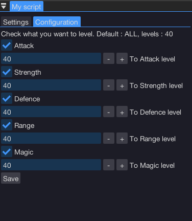
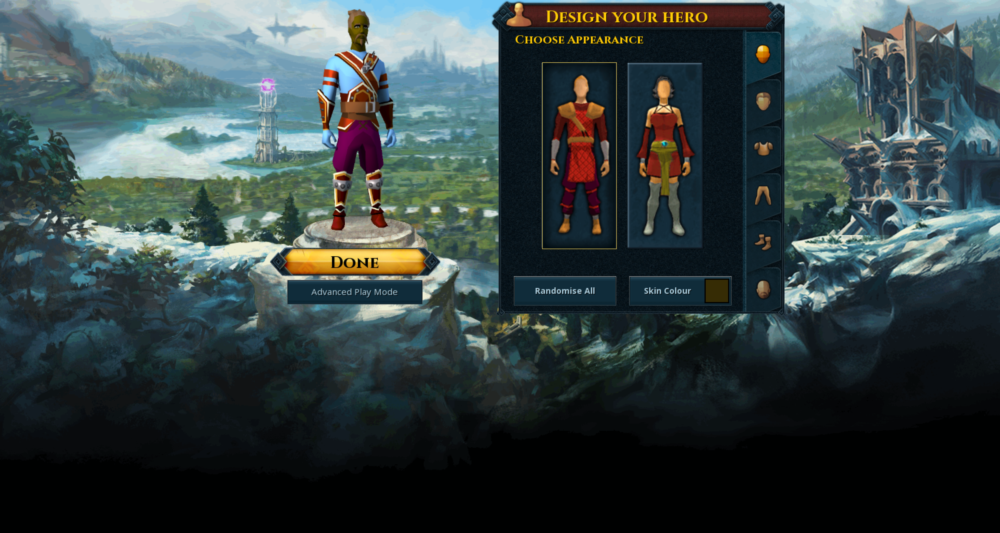
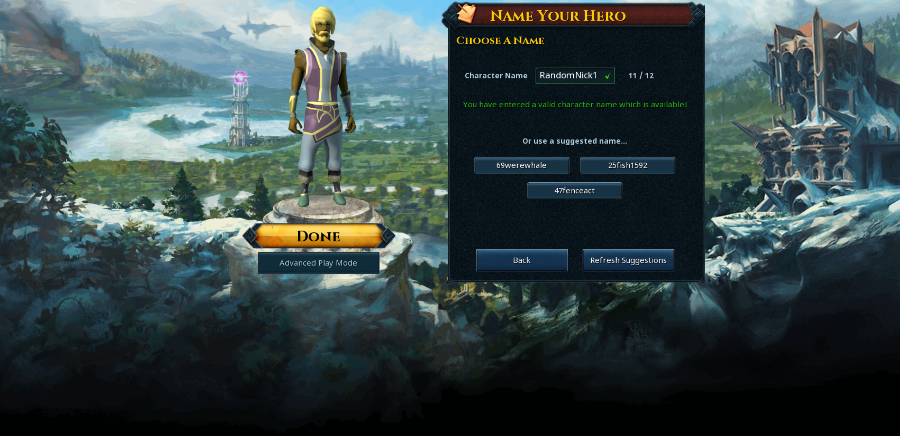
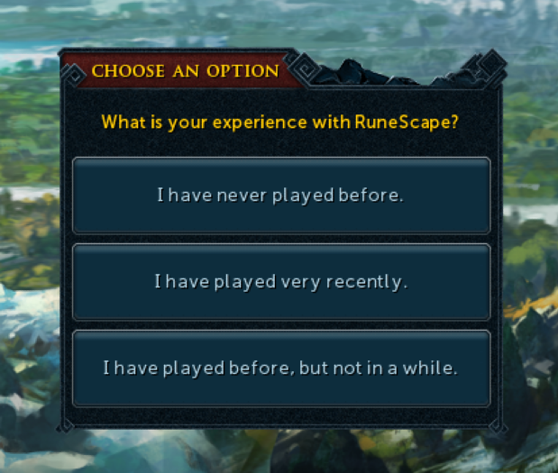
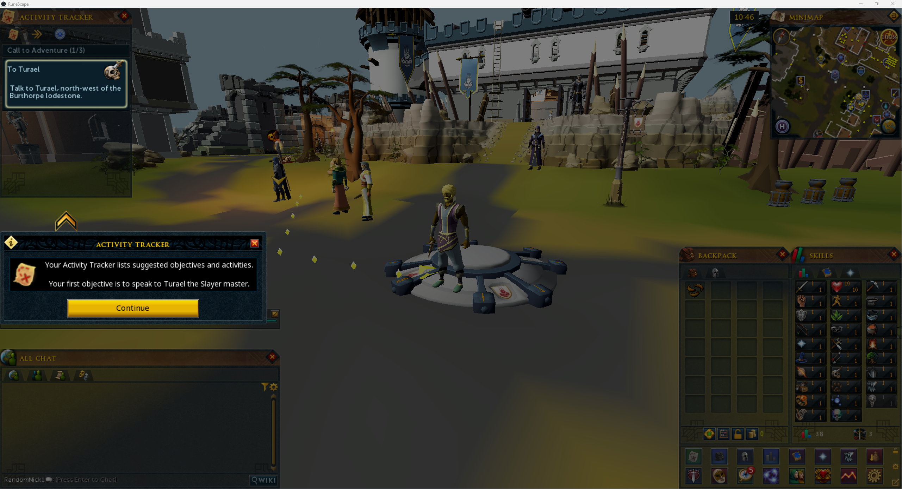
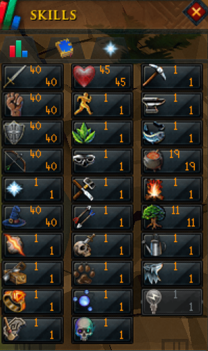
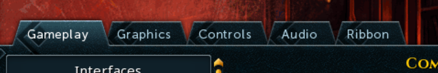

import React from 'react';
import TopBanner from '@site/src/components/TopBanner';
import ContentBlock from '@site/src/components/ContentBlock';
import Changelog from '@site/src/components/Changelog';
import BrowserWindow from '@site/src/components/BrowserWindow';
import changes from './changes.json'

<TopBanner title="Ervinas Fresh To X Combat Stats" version="v0.1" author="Ervinas" skill="Attack">
</TopBanner>

:::hidden

## Cost

:::

<ContentBlock title="Cost">

> - 8$ / 2 days (not including client access)

</ContentBlock>

:::hidden

## Requirements

:::

<ContentBlock title="Requirements">

> - Clean fresh character never launched before

</ContentBlock>

:::hidden

## What Script does

:::

<ContentBlock title="What Script does">
> - UI Settings.
> - Switching combat styles.
> - Guidance system turn off.
> - Gets money for first item buying.
> - Completes GE tutorial.
> - Purchases Melee Armours from Varrock Armour Shop.
> - Purchases Kiteshield and Longsword from Varrock Sword Shop.
> - Purchases Magic Set from Varrock Magic Shop.
> - Purchases Ranged Set from Varrock Range Shop.
> - Moves to training area (At this version only cows hardcoded).
> - Leveling Stats in sequences in same intervals. 
>> - For example :
>>> - 
>>> - Setting these values individually how much progressing you want.
>>> - Script will do the formulas :
>>>> - (skill / 4) * 1
>>>> - (skill / 4) * 2
>>>> - (skill / 4) * 3
>>>> - (skill / 4) * 4
>>> - This will work as first Attack to 10, then go Strength to 10, Defence to 10 and ect, it will level up skills in 4 interations depending on your inputed value.
> - Will pick up food till inventory is full.
> - Will go and cook food after reaching HP threshold and no food is available to eat.
> - Will get back to the cows and continue grinding these levels for you.

</ContentBlock>

:::hidden

## Configuration-Setup

:::

<ContentBlock title="Configuration-Setup">
> - Create new account, and start the bot client as regular.
> - Create character, choose your nickname ect.

> - Select "I have played very recently" to prevent tutorial.

> - Wait for "Intro video" or press ESC.

> - AND YOU WILL LAND TO THIS SCREEN. **DO NOT PRESS ANYTHING**.

> - Get to script selection (top menu "Scripts") and select these :

> - After popping up script settings your can change values as you prefer :

> - Click save button in script "Configuration" tab.
> - Lastly, press Run:

> - Result after the session of 10-12 hours maybe (imagine running 10 accounts during 2 day period. That's a nice account preparation with zero effort) :

</ContentBlock>

:::hidden

## Additional information

:::

<ContentBlock title="Additional information">
> - Script will turn off guidance system information windows.
> - Will enable combat options to use threshold and ultimate abilities during combat.
> - Will prepare a window in settings default view, to open Combat XP tab.
</ContentBlock>

:::hidden

## IMPORTANT

:::

<ContentBlock title="IMPORTANT">
> - If you wish to turn off music or adjust settings in game, please do so after the first stage, when current status **IS NOT** "Managing start"
> - After manually changing settings in game, it's mandatory to get back to :

> - For the love of god and sake, just keep it like that and **do not touch "Gameplay" settings** for now.
> - Happy Botting.
</ContentBlock>

:::hidden

## Information

:::

<ContentBlock title="Information">
> - Tested till 40 levels. All of them achievent maximum.
> - If you are in combat area and somehow it bugs and stops attacking, press Pause and Run again, should be fixed.
> - Script is made intentionally to level up and prepare account for botting at higher levels.
> - After setuping and script running please do not disturb it.
> - If you encouter bugs, please contact me @Ervinas in discord, providing a video would help a lot.
> - If there are suggestions or desires what to add to this script - @Ervinas.
> - Happy Botting. AGAIN.
</ContentBlock>

:::hidden

## My Recommendation

:::

<ContentBlock title="My Recommendation">
> - Do not input high levels in configuration, it will take longer to level up, because of rotations.
>> - Example :
>>> - Inputing 80 at all levels in configuration will give you worse results.
>>> - Iterations : Attack will be leveled to (80/4)*1 which is 20, then strength to (x/4)*1 and ect.
>>> - If you input 40 in skill, it will be leveled up in faster iterations, meaning it will give you more damage output due to smaller iteration of leveling strength, example: 40 in a configuation, which means 40/4*1 is 10. 
>>>> - First Attack to 10 (if selected)
>>>> - Second Strength to 10 (if selected)
>>>> - Third Defense to 10 (if selected)
>>>> - ect...
>> - Recommending starting till 40, and if it's done, then switch to higher level. :)
</ContentBlock>

:::

## Changelog

:::

<Changelog changes={changes}>

</Changelog>
