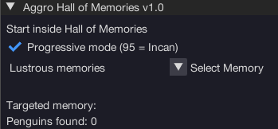

import React from 'react';
import TopBanner from '@site/src/components/TopBanner';
import ContentBlock from '@site/src/components/ContentBlock';
import Changelog from '@site/src/components/Changelog';
import BrowserWindow from '@site/src/components/BrowserWindow';
import changes from './changes.json'

<TopBanner title="Aggro Hall of Memories" version="v1.0.6" author="Aggro" skill="Divination">
</TopBanner>

:::hidden

## Cost

:::

<ContentBlock title="Cost">

> - FREE / month (not including client access)

</ContentBlock>

:::hidden

## Features

:::

<ContentBlock title="Features">

> - Collect Memories inside Hall of Memories
> - Catches 10 Secret Agents a week for penguin points and Clue Caskets
>   -Progressive mode: Best XP based on Divination level
>   -Manual mode: Choose the memory to collect.

</ContentBlock>

:::hidden

## Changelog

:::

<Changelog changes={changes}>

</Changelog>
