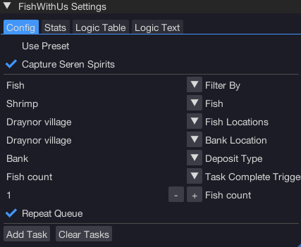
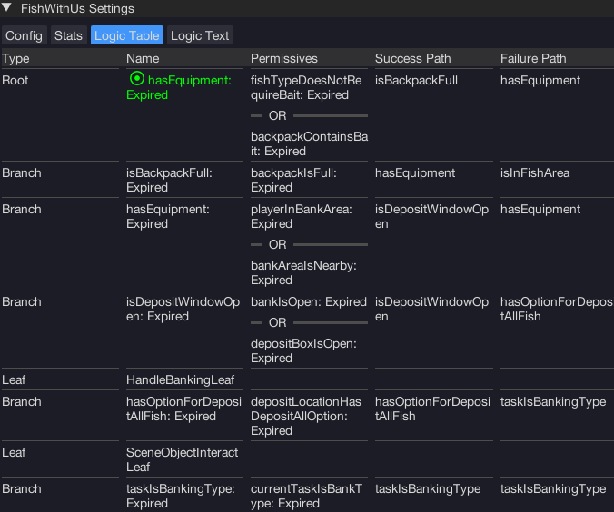
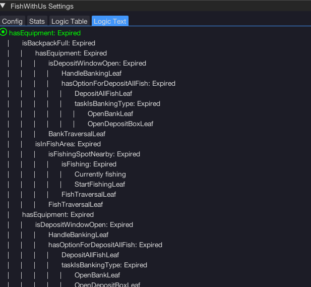

import React from 'react';
import TopBanner from '@site/src/components/TopBanner';
import ContentBlock from '@site/src/components/ContentBlock';
import Changelog from '@site/src/components/Changelog';
import BrowserWindow from '@site/src/components/BrowserWindow';
import changes from './changes.json'

<TopBanner title="FishWithUs" version="v1.0.6" author="BotWithUs" offical="OFFICAL SCRIPT" skill="Fishing">
</TopBanner>

:::hidden

## Cost

:::

<ContentBlock title="Cost">

> - $8 USD / month (not including client access)

</ContentBlock>

:::hidden

## Features

:::

<ContentBlock title="Features">

> - Intelligent fishing. Supports several locations, equipment retrieval, presets, Deep Sea, and more!

</ContentBlock>

:::hidden

## Changelog

:::

<Changelog changes={changes}>

</Changelog>
