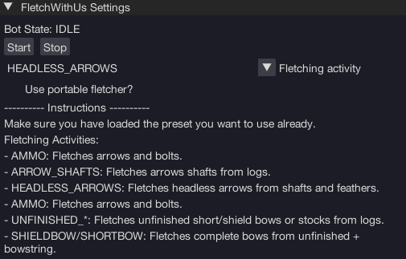

import React from 'react';
import TopBanner from '@site/src/components/TopBanner';
import ContentBlock from '@site/src/components/ContentBlock';
import Changelog from '@site/src/components/Changelog';
import BrowserWindow from '@site/src/components/BrowserWindow';
import changes from './changes.json'

<TopBanner title="FletchWithUs" version="v1.0.6" author="BotWithUs" offical="OFFICAL SCRIPT" skill="Fletching">
</TopBanner>

:::hidden

## Cost

:::

<ContentBlock title="Cost">

> - $ USD / month (not including client access)

</ContentBlock>

:::hidden

## Features

:::

<ContentBlock title="Features">

> - Loads your last presett
> - Fletches bows, ammo, unfinished bows, arrow shafts, headless arrows
> - Logs out when out of supplies
> - Optionally make use of deployed portables

</ContentBlock>

:::hidden

## Requirements

:::
<ContentBlock title="Requirements">

- Use near a bank chest/banker
- Load your preset with the proper resources (i.e if making unfinished bows, have logs of a level you can fletch)

</ContentBlock>

:::hidden

## Changelog

:::

<Changelog changes={changes}>

</Changelog>
