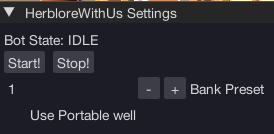

import React from 'react';
import TopBanner from '@site/src/components/TopBanner';
import ContentBlock from '@site/src/components/ContentBlock';
import Changelog from '@site/src/components/Changelog';
import BrowserWindow from '@site/src/components/BrowserWindow';
import changes from './changes.json'

<TopBanner title="HerbloreWithUs" version="v1.0.6" author="BotWithUs" offical="OFFICAL SCRIPT" skill="Herblore">
</TopBanner>

:::hidden

## Cost

:::

<ContentBlock title="Cost">

> - $10 USD / month (not including client access)

</ContentBlock>

:::hidden

## Features

:::

<ContentBlock title="Features">

> - All regular, combination, and bomb potions supported.
> - Use existing portable wells
> - Withdraws preset to make, 1-9

</ContentBlock>

:::hidden

## Requirements

:::
<ContentBlock title="Requirements">

- Use anywhere with a "Bank chest" with option "Use", or a "Banker" with option "Bank"
- (Optional) Use RandomsWithUs to capture seren spirits, catalysts of alteration, divine blessings, or manifested knowledge.

</ContentBlock>

:::hidden

## Changelog

:::

<Changelog changes={changes}>

</Changelog>
