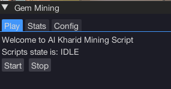
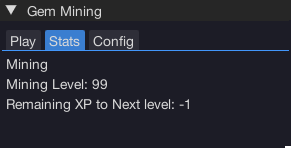
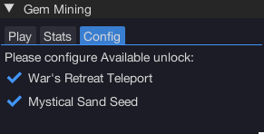

import React from 'react';
import TopBanner from '@site/src/components/TopBanner';
import ContentBlock from '@site/src/components/ContentBlock';
import Changelog from '@site/src/components/Changelog';
import BrowserWindow from '@site/src/components/BrowserWindow';
import changes from './changes.json'

<TopBanner title="Billythebobs Gem Miner" version="v1.0.6" author="Billythebobs" skill="Mining">
</TopBanner>

:::hidden

## Cost

:::

<ContentBlock title="Cost">

> - $FREE USD / month (not including client access)

</ContentBlock>

:::hidden

## Features

:::

<ContentBlock title="Features">

> - Gem Mining Script for Al Kharid location

</ContentBlock>

:::hidden

## Requirements

:::
<ContentBlock title="Requirements">

Togglable Feature(Config Tab):
-- Mysitcal Sand Seed (True by Default ), should be placed in inventory and on action bar.
-- War Retreat Teleport (True by default),required on action bar
</ContentBlock>

:::hidden

## Changelog

:::

<Changelog changes={changes}>

</Changelog>
