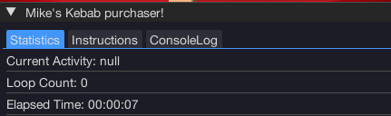
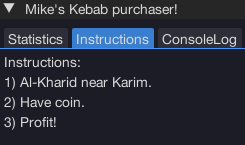

import React from 'react';
import TopBanner from '@site/src/components/TopBanner';
import ContentBlock from '@site/src/components/ContentBlock';
import Changelog from '@site/src/components/Changelog';
import BrowserWindow from '@site/src/components/BrowserWindow';
import changes from './changes.json'

<TopBanner title="MikeKebabPurchaser" version="v1.0.6" author="Mike" skill="Money Making">
</TopBanner>

:::hidden

## Cost

:::

<ContentBlock title="Cost">

> - FREE / month (not including client access)

</ContentBlock>

:::hidden

## Features

:::

<ContentBlock title="Features">

> - A simple script with no account requirements to utilize.
> - Purchases Kebabs at Karim.
> - Before starting script, ensure your last used bank preset has an empty Backpack.
> - Start the script next to Karim with 20k+ coins and you should be good to go for a while.

> - Open-source, not built with best programming practices in mind, but it is a simple functional script which should be easy to follow :)
>   https://github.com/devMikeyB/MikeKebabBuyer

</ContentBlock>

:::hidden

## Changelog

:::

<Changelog changes={changes}>

</Changelog>
