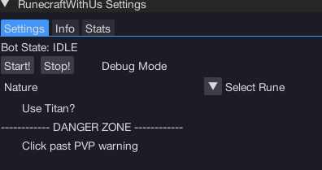
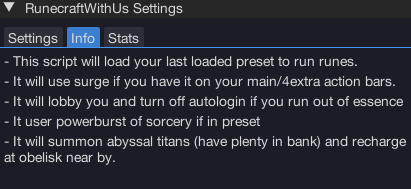
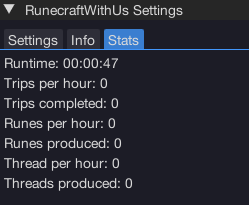

import React from 'react';
import TopBanner from '@site/src/components/TopBanner';
import ContentBlock from '@site/src/components/ContentBlock';
import Changelog from '@site/src/components/Changelog';
import BrowserWindow from '@site/src/components/BrowserWindow';
import changes from './changes.json'

<TopBanner title="RunecraftWithUs" version="v1.0.6" author="BotWithUs" offical="OFFICAL SCRIPT" skill="Runecrafting">
</TopBanner>

:::hidden

## Cost

:::

<ContentBlock title="Cost">

> - $15 USD / month (not including client access)

</ContentBlock>

:::hidden

## Features

:::

<ContentBlock title="Features">

> - Supports all runes in abyss except soul (coming soon)
> - Supports all pouches / repairing them
> - Supports wilderness sword / glory teleing, otherwise it uses edge lodestone
> - Surges if surge is on the actionbar.
> - Loads last bank preset
> - Will use powerburst of sorcery if in preset
> - Will summon abyssal titans from your bank (make sure you have plenty) - recharges points at obelisk near GE.
> - Gets you lots of runes for bossing / selling.

</ContentBlock>

:::hidden

## Requirements

:::
<ContentBlock title="Requirements">

- Select a rune that you can make / have the altar unlocked for
- A bank preset with desired equipment / rune essence and one of: wildy sword/charged glory equipped, desired pouches, powerburst of sorcery (optional), abyssal titan pouches in bank

</ContentBlock>

:::hidden

## Changelog

:::

<Changelog changes={changes}>

</Changelog>
