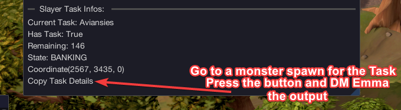

import React from 'react';
import TopBanner from '@site/src/components/TopBanner';
import ContentBlock from '@site/src/components/ContentBlock';
import Changelog from '@site/src/components/Changelog';
import BrowserWindow from '@site/src/components/BrowserWindow';
import changes from './changes.json'

<TopBanner title="EmmaSlayer" version="v0.7.0 - Grumpy Penguin" author="Emma" skill="Slayer">
</TopBanner>

:::hidden

## Cost

:::

<ContentBlock title="Cost">

> - Undecided. Currently in Private Beta
</ContentBlock>

:::hidden

## Slayer Masters

:::

<ContentBlock title="Slayer Masters">

> - The Raptor
> - Duradel/Lapalok
> - Kuradel

</ContentBlock>

<ContentBlock title="Requirements">

>  - Atleast a Combat Level of 60
>  - Super Antifires for Dragons
>  - Nose Peg in Bank for Aberrant Spectres

</ContentBlock>

<ContentBlock title="Features">
>  - Healing
>  - Restoring Prayer Points
>  - Attacking of stranglers once a certain amount are attacking us
>  - Drinking of Antifire Potion for Dragon Tasks
>  - Equipping and withdrawing of Slayer Equipment
>  - Special Logic for uncovering Strykewyrms
>  - Dodging Strykewyrm Burrow
>  - Chicken Mode (Teleport to Wars Retreat on Low HP)
>  - Gathering of Mobs before AoE'ing them down
>  - Looting (Charms,Runes,Bones,Coins,Custom)
>  - Burying Bones
>  - Hopping Worlds on Players around
>  - Skipping Tasks using Slayer Master
>  - Ancient elven ritual shard

</ContentBlock>

<ContentBlock title="How to contribute">

</ContentBlock>

<ContentBlock title="Supported Tasks">

> - Kalphite
> - Fetid zombies
> - Grotworms
> - Bloodveld
> - Iron dragons
> - Fire giants
> - Waterfiends
> - Black dragons
> - Aberrant spectres
> - Goraks
> - Steel dragons
> - Fungal magi
> - Hellhounds
> - Black demons
> - Mithril dragons
> - Living rock creatures
> - Greater demons
> - Adamant dragons
> - Gargoyles
> - Aquanites
> - Jungle strykewyrms
> - Nechryael
> - Zombies
> - Dragons
> - Undead
> - Zemouregal's undead
> - Ghosts
> - Lesser demons
> - Blue dragons
> - Ascension members
> - Desert strykewyrms
> - Ankou
> - Risen Ghost
> - Grifolaroo
> - Glacor

- Aviansies No Navigation to GWD at the moment
- Spiritual mages No Navigation to GWD at the moment

</ContentBlock>

:::hidden

## Changelog

:::

<Changelog changes={changes}>

</Changelog>
