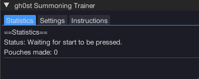
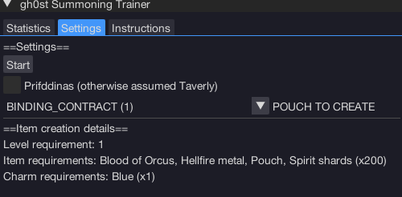
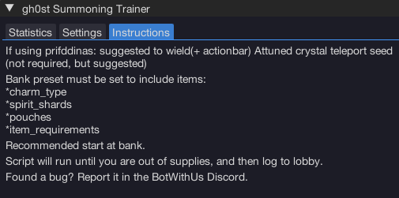

import React from 'react';
import TopBanner from '@site/src/components/TopBanner';
import ContentBlock from '@site/src/components/ContentBlock';
import Changelog from '@site/src/components/Changelog';
import BrowserWindow from '@site/src/components/BrowserWindow';
import changes from './changes.json'

<TopBanner title="gh0st summoner" version="v1.0.6" author="Ghost" skill="Summoning">
</TopBanner>

:::hidden

## Cost

:::

<ContentBlock title="Cost">

> - FREE / month (not including client access)

</ContentBlock>

:::hidden

## Features

:::

<ContentBlock title="Features">

> - All pouches (Note: scrolls are not currently supported)
> - Uses auto item selector (Important: please ensure item requirements are in inventory)
> - Script will shut down when out of ingredients by logging you to lobby.

## Locations Supported

- **Priffddinas** (recommended: Attuned Crystal Teleport Seed equipped + on action bar, item is NOT required)
  - If item is not in use, the script will rest when low on run energy
- **Taverly**
  - Will rest when low on run energy

</ContentBlock>

:::hidden

## Requirements

:::
<ContentBlock title="Requirements">

- If using Prifddinas, start at Ithell bank chest. If using Taverly, start at Taverly bank
- Load Last Preset from MUST load your correct preset with:
  - Spirit shards
  - Charms
  - Pouches
  - Item ingredients

</ContentBlock>

:::hidden

## Changelog

:::

<Changelog changes={changes}>

</Changelog>
