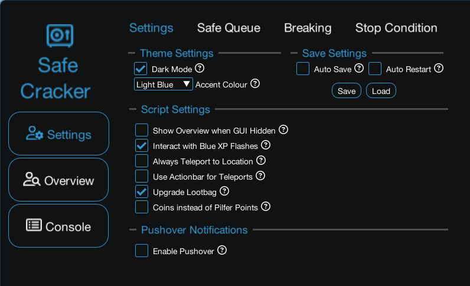
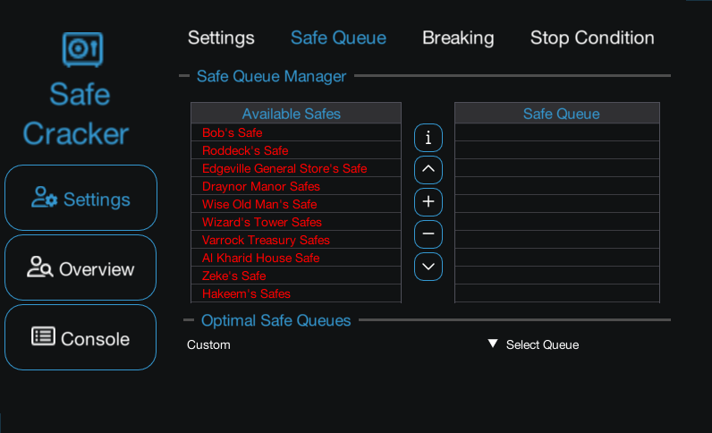
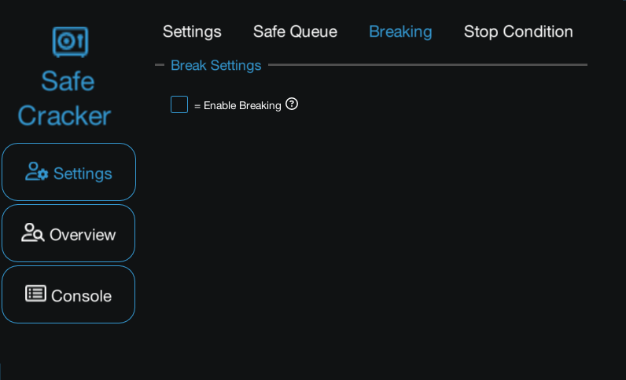
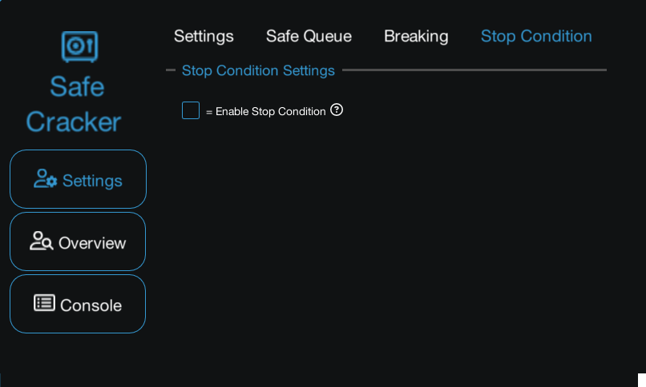

import React from 'react';
import TopBanner from '@site/src/components/TopBanner';
import ContentBlock from '@site/src/components/ContentBlock';
import Changelog from '@site/src/components/Changelog';
import BrowserWindow from '@site/src/components/BrowserWindow';
import changes from './changes.json'

<TopBanner title="Safe Cracker" version="v1.0.6" author="pzoot" skill="Thieving">
</TopBanner>

:::hidden

## Cost

:::

<ContentBlock title="Cost">

> - $10 USD / month (not including client access)

</ContentBlock>

:::hidden

## Features

:::

<ContentBlock title="Features">

> - Cracks Safes for Thieving XP.
> - Contains prests of optimal safe routes for all levels 62-99
> - Will trade in loot for coins/pilfer points

</ContentBlock>

:::hidden

## Requirements

:::
<ContentBlock title="Requirements">

- 62 thieving
- basic lodestones unlocked
- A Guild of Our Own quest complete\

</ContentBlock>

:::hidden

## Changelog

:::

<Changelog changes={changes}>

</Changelog>
