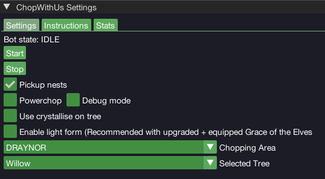
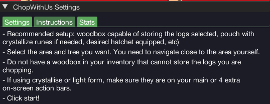
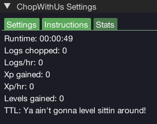

import React from 'react';
import TopBanner from '@site/src/components/TopBanner';
import ContentBlock from '@site/src/components/ContentBlock';
import Changelog from '@site/src/components/Changelog';
import BrowserWindow from '@site/src/components/BrowserWindow';
import changes from './changes.json'

<TopBanner title="ChopWithUs" version="v1.0.6" author="BotWithUs" offical="OFFICAL SCRIPT" skill="Woodcutting">
</TopBanner>

:::hidden

## Cost

:::

<ContentBlock title="Cost">

> - FREE / month (not including client access)

</ContentBlock>

:::hidden

## Features

:::

<ContentBlock title="Features">

> - Chop trees in 9 Locations: Draynor, Tai Bwo Wannai, Ape Atoll, Seers, Catherby, Falador, Sorcerer's Tower, Fort Forinthry, Menaphos
> - Bank or drop logs
> - Supports wood box
> - Picks up bird nests
> - Stat tracker

##### Supported Logs

- Logs, Oak, Willow, Teak, Mahogany, Acadia, Maple, Yew, Magic, Ivy

##### Unsupported Trees

- Elder (except at fort)
- Crystal

</ContentBlock>

:::hidden

## Requirements

:::
<ContentBlock title="Requirements">

- Start within ~75 tiles of your desired chopping area, near the bank.

</ContentBlock>

:::hidden

## Changelog

:::

<Changelog changes={changes}>

</Changelog>
